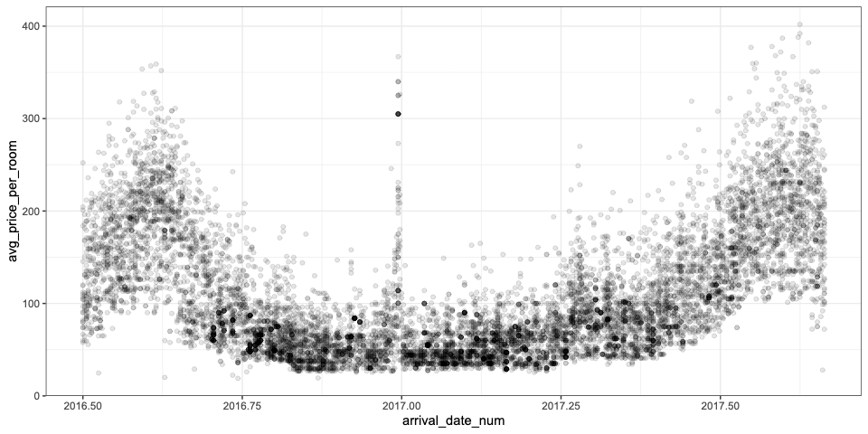

Advanced Feat Eng Workshop
Instructors: Max Kuhn, Emil Hvitfeldt

# SLIDES 1

knitr::purl()
I had no clue this function existed but you can pull executable code from an Rmd or qmd and it creates a new .R file with just the R code

Exploring data with PCA:
class_data |>
  recipe(class ~ ., data = class_data) |>
  step_pca(all_predictors(), num_comp = 2) |>
  prep() |>
  bake(new_data = NULL) |>
  ggplot(aes(PC1, PC2, col = class)) +
  geom_point(alpha = 0.50)

Consider using a validation set (instead of vfold, or in addition) if your data set is huge and you don't have sufficient RAM to model.

Brier class might be the best model evaluation metric for classification models. Kind of like an RMSE for classification. It's often used as a MEASURE of calibration, not so much for calibration itself.
Brier score of zero is best, and for two classes values > 0.25 are bad (if your class threshold is 0.5). Very much the sums of square errors for calibration (which is why it is similar to RMSE).

On Calibration: This is a property of individual probability,

# SLIDES 2

The data set is 10:1 imbalanced. In code example below, class_weights weights the minority class by 3x. Stop iterations after 10 bad iterations (not increasing)

nnet_ex_spec <-
  mlp(hidden_units = 20, penalty = 0.01, learn_rate = 0.005, epochs = 100) |>
  set_engine("brulee", class_weights = 3, stop_iter = 10) |>
  set_mode("classification")

# SLIDES 3 - brulee tuning

In a tuning procedure for NNs via brulee, you can tune across the different activation functions to see which one works best for your problem statement. Often times, the best activation fn is obvious through visualizations.

# SLIDES 4 - embed and encoding

step_dummy_extract()
- https://workshops.tidymodels.org/slides/advanced-04-feature-engineering-part-one.html#/advanced-dummies---extraction-1
- https://recipes.tidymodels.org/reference/step_dummy_extract.html

UMAP - great for fitting near neighbors, but generally over fits... it will find clusters if they're there, but it will also find clusters if they're not there

# SLIDES 5 - nonlinear and splines

Non-linear features would struggle with algos like OLS or tree-based models (b/c we'd need to transform the data appropriately). Gradient boosting models would do well here, but the feature below (against the target variable on the y-axis):

ggplot2's `geom_smooth()` is a form of splines layered on top of visualizations

step_lencode_glm() now (always?) works on regression problems as well as classification problems

# SLIDES 6 - tailor

- Adjustment order matters; tailor will error early if the ordering rules are violated.
- Adjustments that change class probabilities also affect hard class predictions.
- Adjustments happen before performance estimation.
    - Undoing something like a log transformation is a bad idea here.
- We have more calibration methods in mind.

Probability threshold adjustments should not (and does not) affect the Brier or ROC metrics.
