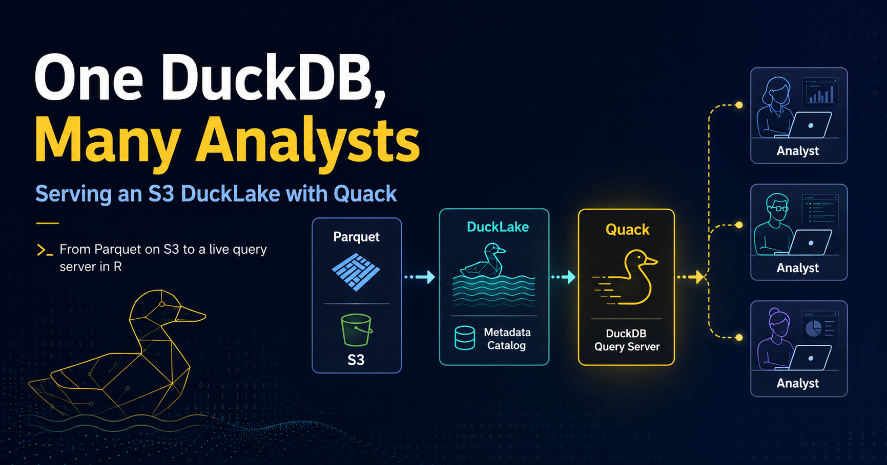

{.preview-image}

# Stop Copying Parquet Files Around

DuckDB continues to innovate in meaningful ways. Quack landed as a core extension around DuckDB 1.5.3, and the [v2.0 Cyanoptera preview](https://duckdb.org/2026/08/17/duckdb-20-highlights.html){target="_blank"} already said it would graduate to stable this fall.

[v2.0-alpha is generally available now](https://duckdb.org/2026/09/02/try-duckdb-20-alpha.html){target="_blank"}, with a feature freeze and a second-half-of-October target, so the "DuckDB as a server" story is in motion rather than just a headline.

I recently got to contribute that protocol support to Travis Gerke's [`ducklake`](https://tgerke.github.io/ducklake-r/){target="_blank"} package for R users. It's a tidy-friendly wrapper around [DuckLake](https://ducklake.select/){target="_blank"}, DuckDB's lakehouse format, and it can serve a lake over the network.

Every time I've recently explained this to a friend, the same question comes back: *"So I convert my Parquet files into a DuckDB and put that on S3?"* Not quite, and untangling that is honestly half the value of this post.

So let's build the whole thing end to end. But first, some groundwork on the problem this actually solves, because Quack only makes sense as an answer to a specific pain.

# How Teams Share Analytical Data Today

Here's the ladder most organizations climb. See where you sit.

**Level 0 - Nobody shares anything.** Datasets move as CSV, XPT, or Excel attachments. Somebody has `analysis_final_v3_USE_THIS.parquet` on their desktop. There's no audit trail, no versioning, and the answer to "which copy is current?" is whoever spoke last. This is still, by a wide margin, the most common state of affairs.

**Level 1 - A bucket everyone reads.** Parquet lands on S3, and each analyst runs DuckDB locally against it:

```{r}
#| eval: false
# The status quo for a lot of teams
con <- DBI::dbConnect(duckdb::duckdb())
DBI::dbExecute(con, "CREATE SECRET (TYPE s3, PROVIDER credential_chain)")

DBI::dbGetQuery(con, "
  SELECT carrier, AVG(arr_delay)
  FROM read_parquet('s3://dsb-flights-lake/legacy/*.parquet')
  GROUP BY carrier
")
```

This is a genuine improvement and it's fast. But look at what's missing. There's no catalog, so there are no snapshots, no schema evolution, no record of who changed what. Every analyst needs their own IAM credentials. Two people writing at the same time will happily clobber each other. And "which prefix is the current one" quietly becomes tribal knowledge again - you've moved the `_v3_FINAL` problem from a filename to an S3 path.

**Level 2 - DuckLake with a shared catalog.** This is where the `ducklake` package normally lives. You put a small catalog database (PostgreSQL or SQLite) next to the S3 prefix, and suddenly you have versioning, time travel, ACID transactions, author-attributed commit messages, and safe concurrent writers. It's a real lakehouse, and for a lot of teams it's the right stopping point.

The constraint that remains: **every client still needs direct read and write access to the storage path.** Each analyst mounts the bucket. The credential sprawl from Level 1 is still there - you've fixed correctness, not access.

**Level 3 - A warehouse.** Redshift, Snowflake, Databricks. Governance is solved, permissions are centralized, and someone else runs the thing. You're also paying for a cluster whether or not anyone queries it, and your analysts are back to shipping SQL over a network API instead of doing local columnar scans.

::: {.callout-tip}
## Where Quack fits
Between Level 2 and Level 3. You keep the lakehouse semantics and the DuckDB speed, but you get one governed door in front of the storage instead of fifteen sets of credentials, without standing up a warehouse.
:::

## Why this is a notable change for DuckDB

DuckDB's entire design premise is that it's *embedded* - no server, no daemon, it runs inside your R session (or Python, Go, Java, Rust, Node, etc.) like SQLite does. That's why it's so pleasant to use, and it's also precisely why sharing has always been the awkward part. An embedded database has nothing for a second machine to connect to.

[Quack](https://duckdb.org/docs/current/quack/overview){target="_blank"}, a core extension as of DuckDB 1.5.3, lets one DuckDB instance optionally act as a server while others connect to it as clients. That's a meaningful departure from the embedded-only story, and it's why I think this is worth your attention even if you don't need it today.

# The Two Axes People Conflate

With that background, here's the framing that makes the rest of this click. There are two independent questions, and mixing them up is what produces the "convert my Parquet into a DuckDB" confusion.

**Where do the bytes live?** A DuckLake is not a file format. It's a *catalog* - a small database of metadata about tables, snapshots, and which Parquet file holds which rows - plus a *data path* full of ordinary Parquet files. The data path can be a local directory or `s3://your-bucket/prefix`. Nothing is ever converted into "a DuckDB."

**Who does the reading?** By default, every analyst's own DuckDB process reaches storage directly and needs credentials to do it. With Quack, one DuckDB instance holds the credentials and everyone else talks to it.

| | Without Quack (Level 2) | With Quack |
|---|---|---|
| What the client connects to | The catalog DB *and* the Parquet storage | One DuckDB server |
| Storage access each client needs | Read/write on the same data path | None - only the server touches files |
| Extra service to run | A PostgreSQL server (SQLite needs none) | A DuckDB server process |
| Good fit when | Everyone can mount the same storage | Data sits in one place and you want to share access to it |

So: **S3 answers "where is the data?" Quack answers "who is allowed to read it, and from where?"** You can use either alone. Using both is where it gets interesting.

That second axis is the part I find genuinely useful in a corporate setting. Handing out bucket credentials to fifteen analysts so they can each mount storage is a governance headache with a large surface area. One server that holds the credentials and hands back result sets is a much smaller one.

Enough prose. Let's try this out.

# Setup

Quack itself arrived as a core extension around DuckDB 1.5.3, so both ends still need at least that engine. For the R `ducklake` path, I would pin `duckdb` to **1.5.5 or newer**.

DuckDB 1.5.2 ships the DuckLake 1.0 spec, and 1.5.5 is where the R package settled extension storage, which `ducklake` relies on. The package errors clearly on older engines, but save yourself the trip:

```{r}
#| eval: false
install.packages("ducklake")  # CRAN; wants duckdb >= 1.5.5
# pak::pak("tgerke/ducklake-r")  # GitHub remotes, if you need them

library(ducklake)
library(dplyr)

packageVersion("duckdb")
#> [1] '1.5.5'

# attach_ducklake() downloads the DuckLake extension on first use
install_ducklake()  # optional, for container images and offline hosts
install_quack()     # Quack is core; pre-install it if the host will be offline
```

I'll use `nycflights13::flights` as the demo dataset - 336k rows is small enough to run on a laptop and big enough that pulling it across a network to filter it locally is obviously the wrong move.

# Step 1: Point the Lake at S3

Here's the first real gotcha, and it took me a beat to internalize. With the default `backend = "duckdb"`, the catalog is a *DuckDB database file*, so `lake_path` has to be local. If you want your Parquet on S3, you need a catalog backend that isn't a file sitting next to the data - SQLite for a single writer, PostgreSQL for many.

Credentials first. Register them with DuckDB's secrets manager:

```{r}
#| eval: false
create_storage_secret(
  "s3",
  provider = "credential_chain",  # picks up env vars, profiles, instance metadata
  scope = "s3://dsb-flights-lake"
)
```

I'd push hard on `provider = "credential_chain"` over pasting keys into a script. On an EC2 box or ECS task it resolves the instance role and there is nothing to leak. If you must pass keys explicitly, pull them from the environment and leave `persistent = FALSE` so they stay in memory:

```{r}
#| eval: false
create_storage_secret(
  "s3",
  key_id = Sys.getenv("AWS_ACCESS_KEY_ID"),
  secret = Sys.getenv("AWS_SECRET_ACCESS_KEY"),
  region = "us-west-2",
  scope = "s3://dsb-flights-lake"
)
```

Now attach the lake. The SQLite file is the catalog; `lake_path` is where the Parquet goes:

```{r}
#| eval: false
attach_ducklake(
  "flights_lake",
  backend = "sqlite",
  catalog_connection_string = "~/lakes/flights_catalog.sqlite",
  lake_path = "s3://dsb-flights-lake/data/"
)
```

::: {.callout-warning}
## Catalog and data are separate concerns
The catalog is small, transactional, and the thing that must not be lost - back it up like a database. The S3 prefix is bulk columnar storage. If you're using PostgreSQL as the catalog backend, note that the `postgres` and `mysql` DuckDB extensions don't build on Windows; SQLite and DuckDB backends do.
:::

# Step 2: Get Data In (Two Ways)

**If you're starting from a data frame**, `create_table()` writes Parquet straight to the S3 data path, wrapped in a versioned transaction:

```{r}
#| eval: false
library(nycflights13)

with_transaction(
  create_table(flights, "flights_raw"),
  author = "Javier Orraca-Deatcu",
  commit_message = "Initial load of 2013 NYC flights"
)

with_transaction(
  get_ducklake_table("flights_raw") |>
    filter(!is.na(arr_delay)) |>
    mutate(delayed = arr_delay > 15) |>
    create_table("flights_clean"),
  author = "Javier Orraca-Deatcu",
  commit_message = "Drop cancelled flights, add delay flag"
)
```

**If you already have Parquet on S3** - which describes most teams stuck at Level 1 - do *not* rewrite it. `add_data_files()` registers files in place, no copy, no re-encode. This is the actual migration path off the status quo:

```{r}
#| eval: false
# Table must exist first with a compatible schema
create_table(
  data.frame(
    year = integer(), month = integer(), carrier = character(),
    arr_delay = numeric()
  ),
  "flights_history"
)

add_data_files(
  "flights_history",
  c(
    "s3://dsb-flights-lake/legacy/flights_2011.parquet",
    "s3://dsb-flights-lake/legacy/flights_2012.parquet"
  ),
  ignore_extra_columns = TRUE
)
```

One caveat worth reading twice in the docs: ownership of those files transfers to DuckLake. A later compaction step can rewrite and delete them. Don't register files that another pipeline still reads directly.

At this point you have a versioned lake with a full audit trail - the thing Level 1 could never give you:

```{r}
#| eval: false
list_table_snapshots()
#>   snapshot_id       snapshot_time                     author
#> 1           0 2026-08-08 09:14:02                       <NA>
#> 2           1 2026-08-08 09:14:03  Javier Orraca-Deatcu
#> 3           2 2026-08-08 09:14:07  Javier Orraca-Deatcu
```

# Step 3: Serve It

Everything so far assumed *you* have S3 access - that's Level 2. Now let's make it so nobody else needs it. From the same session holding the lake:

```{r}
#| eval: false
quack_serve(
  uri = "quack:lake.internal.example.org",
  token = Sys.getenv("QUACK_TOKEN")
)
#> Quack server listening on "quack:lake.internal.example.org".
```

Two things I appreciate here. The server runs in the background of the DuckDB instance, so your R session stays usable - this isn't a blocking `plumber::pr_run()` situation. And the default `uri` is `quack:localhost`, which means the safe thing happens if you fat-finger the config: you've served it to yourself and nobody else.

The token is the entire access control story, so treat it accordingly. Serving without one raises a warning, and rightly so. On anything other than a trusted internal network, put it behind TLS or a reverse proxy.

# Step 4: The Analyst's Side

This is the payoff. On a laptop with `duckdb` and `ducklake` installed and no AWS configuration whatsoever:

```{r}
#| eval: false
library(ducklake)
library(dplyr)

delays <- quack_query(
  "quack:lake.internal.example.org",
  "SELECT carrier, month,
          COUNT(*) AS n,
          AVG(arr_delay) AS mean_delay
   FROM flights_lake.flights_clean
   WHERE delayed
   GROUP BY carrier, month",
  token = Sys.getenv("QUACK_TOKEN")
)

delays |>
  summarise(
    worst_month = first(month, order_by = desc(mean_delay)),
    .by = carrier
  ) |>
  arrange(carrier)
```

Note `flights_lake.flights_clean` - the query runs *on the server*, so tables are addressed by the catalog name the lake was attached under. And note what came back: a summarized data frame, not 336,000 rows. Let the server do the aggregation. That's the whole point of pushing compute to where the data is.

Because Quack supports concurrent writers, this also works, which surprised me the first time:

```{r}
#| eval: false
quack_query(
  "quack:lake.internal.example.org",
  "INSERT INTO flights_lake.flights_clean
   SELECT * FROM read_parquet('...')",
  token = Sys.getenv("QUACK_TOKEN")
)
```

Several analysts can write at once without locking each other out, and every write lands as a snapshot in the same audit trail.

## The gotcha that will cost you an hour

If the server is sharing a *plain DuckDB database* rather than a DuckLake, you get the nicer dbplyr path:

```{r}
#| eval: false
attach_quack("warehouse", "quack:data.example.org", token = Sys.getenv("QUACK_TOKEN"))

get_ducklake_table("warehouse.sales") |>
  filter(region == "EMEA") |>
  collect()

detach_quack("warehouse")
```

But a **served DuckLake is a separate catalog on the server, not part of its default database**, so its tables aren't reachable this way. For a lake, you use `quack_query()` with the catalog name. I burned real time on this before it clicked, so: `attach_quack()` for plain databases, `quack_query()` for lakes.

# So When Would I Actually Use This?

Quack is not a replacement for a real warehouse, and the package docs are refreshingly honest about that - for very high write volumes, use a purpose-built database.

Where it fits, in my view:

- **Analysts who can't mount the storage.** This is the big one, and it's the Level 2 constraint. The data sits on one machine or one bucket, and you want a governed door in front of it rather than fifteen sets of credentials.
- **A small team on one versioned dataset.** Time travel plus author-attributed commit messages is a genuinely nice property for anything that gets audited.
- **Alongside a shared catalog, not instead of it.** PostgreSQL catalog so the lake supports many writers, Quack in front so people who can't reach the storage can still connect. That combination is what I keep coming back to.

If everyone on your team can already mount the same bucket, stop at Level 2 - a shared PostgreSQL or SQLite catalog is simpler and there's no server to babysit.

::: {.callout-important}
## Preview on 1.5.x, stable with 2.0
On the DuckDB 1.5.x path, Quack is still beta/preview. It graduates to stable in v2.0 (the extension moves from 0.x to 1.0), and [v2.0-alpha is already out](https://duckdb.org/2026/09/02/try-duckdb-20-alpha.html){target="_blank"} if you want to try it.

The alpha is not production-ready. I'd run Quack for internal team sharing on 1.5.5 today, but I would pin versions and wait for 2.0 to ship before I leaned on it in a production pipeline.
:::

# What's Next

Two things I am watching, and they are not the same product.

**Quack going stable with DuckDB 2.0.** Cyanoptera is targeted for this fall. The [v2.0 highlights](https://duckdb.org/2026/08/17/duckdb-20-highlights.html){target="_blank"} frame it as "DuckDB as a server," and the [alpha announcement](https://duckdb.org/2026/09/02/try-duckdb-20-alpha.html){target="_blank"} says the Quack extension moves from 0.x to 1.0 with higher throughput and better compatibility.

If you write SQL by hand, `CONNECT` is the cleaner client story (the successor to `remote.query`). The R helpers in [`ducklake`](https://tgerke.github.io/ducklake-r/){target="_blank"} stay the right interface for this walkthrough. I'd try the alpha on a scratch lake, not as a production cutover.

**Async I/O against Parquet on S3.** This one is not Quack-specific, and it might be the more useful 2.0 change for a lot of us who already point DuckDB at a lake. v2.0 adds [asynchronous reads of Parquet and CSV](https://duckdb.org/2026/07/31/asynchronous-io.html){target="_blank"}. The big win is EC2 talking to S3, where synchronous requests leave bandwidth on the table.

Their TPC-H Q6 benchmark on remote Parquet landed around 3 times faster. It also helps when a lake is a pile of small Parquet files. DuckLake on Parquet picks this up automatically.

That is the part I find exciting for R and Python data scientists, and for MLOps jobs that scan S3 Parquet for features, training extracts, or batch scores. You do not have to stand up Quack to get it. Local DuckDB against the lake gets faster. Quack is how you share access. Async I/O is how the engine spends less time waiting on object storage.

# Learn More

- [`ducklake` R package](https://tgerke.github.io/ducklake-r/){target="_blank"} by [Travis Gerke](https://github.com/tgerke){target="_blank"} - the pkgdown site is excellent
- [Quack Remote Access vignette](https://tgerke.github.io/ducklake-r/articles/quack-remote-access.html){target="_blank"} - the source material for most of this post
- [DuckDB Quack documentation](https://duckdb.org/docs/current/quack/overview){target="_blank"} - deployment options, TLS, reverse proxies
- [DuckLake specification](https://ducklake.select/docs/stable/specification/introduction){target="_blank"}
- [`dplyneage`](https://github.com/tgerke/dplyneage){target="_blank"} - column-level lineage for dbplyr pipelines, pairs nicely with lake tables
- [A Preview of DuckDB v2.0](https://duckdb.org/2026/08/17/duckdb-20-highlights.html){target="_blank"} - Cyanoptera highlights, including Quack going stable and `CONNECT`
- [Try DuckDB v2.0-alpha](https://duckdb.org/2026/09/02/try-duckdb-20-alpha.html){target="_blank"} - feature freeze, October target, Quack 1.0
- [Asynchronous I/O in DuckDB](https://duckdb.org/2026/07/31/asynchronous-io.html){target="_blank"} - faster Parquet/CSV reads on S3, including DuckLake lakes

```{r}
#| eval: false
sessionInfo()
```

---

If you're sitting at Level 0 or Level 1 with a pile of Parquet in S3 and a team that keeps emailing each other CSVs, this is a genuinely small amount of setup for a big change in how people work. Try it on one dataset first - the medallion pattern in the package docs is a good template.

And if you already live at Level 1, pointing DuckDB at S3 from R or Python, the async I/O work in 2.0 is worth a look even if you never stand up a Quack server.

Happy Monday, and happy coding!
