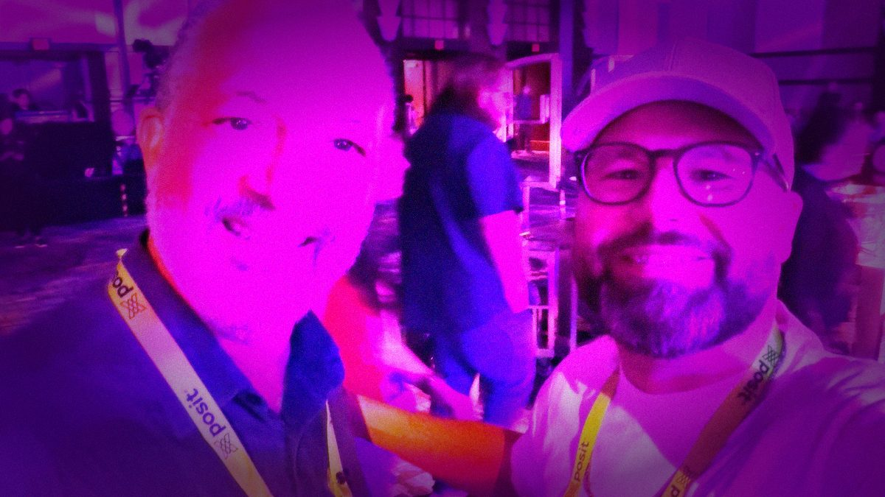

{.preview-image}

# The user group I keep recommending is not an R meetup

I am in Houston for [posit::conf(2026)](https://conf.posit.co/2026/){target="_blank"}, and I ended up at the AWS + Posit `conf::rewind` 80s party looking like I had wandered out of a synthwave music video. That is [Derrick Cogburn](https://www.linkedin.com/in/dcogburn){target="_blank"} on the left, a professor at American University. I am the one in the hat.

I showed him the [Grok Bot loop I use to draft and ship posts](https://www.javierorracadeatcu.com/posts/2026-09-14-agentic-quarto-blog/){target="_blank"} on this site. The conversation did not stay on blogging for long. Derrick wants a community data science organization that is polyglot, diverse in topic, and open to AI. He was not asking me how to stand up another R-only meetup.

I have founded and run a company data science user group at Centene. I also help run the [Southern California R Users Group](https://www.meetup.com/socal-rug/){target="_blank"} (SoCal RUG). Those groups taught me a lot. They are also the wrong thing to copy if what you actually want is a local or company community where R, Python, SQL, BI, and AI agents can share a room.

This post is the template I wish I could have handed Derrick at the party. It is also for you, if you have been waiting for permission to start one.

The spine comes from Posit's [Champions community-building guide](https://posit.co/champions/community-building){target="_blank"}. I am paraphrasing their ideas into a playbook you can steal tomorrow. I am not rewriting their page. If you only click one link after this, click that one.

# What kind of community are you building?

Posit's first question is the one people skip: what do you want people to get out of this?

In my experience, most "we should start a user group" conversations collapse three different goals into one calendar invite.

**Learning.** People leave with a skill, a pattern, or a dataset they can reuse on Monday.

**Networking.** People leave knowing two new names and one person they might actually email.

**Internal enablement.** People leave less stuck on the company's stack, and the org gets a cheaper way to spread practice than another training vendor.

The Centene group was mostly enablement plus learning. SoCal RUG is mostly learning plus networking. Both work. They do not work if you pretend they are the same meeting.

Write the goal in one sentence before you book a room. Here are three I would actually use:

- "A monthly company hour where analysts show how they solved a real problem, in whatever language they used."
- "A city meetup for data people who want one talk, one conversation, and a reason to leave the house."
- "A low-stakes practice room for first talks, including people who have never presented outside their team."

If you cannot pick one, pick learning. Learning gives newcomers a reason to come back. Networking happens around a useful hour. A mixer with no spine is a happy hour that dies in month three.

::: {.callout-tip}
## Write the goal where other people can see it
Put the one-sentence goal in the Meetup description, the Slack topic, and the first slide. If a speaker pitch does not serve that sentence, it is a different event. Protect the sentence.
:::

A polyglot group still needs a boundary. "Everyone who touches data" is not a community. It is a conference. I recommend a sharper line: practitioners who want to share work, including students and career-switchers, in any language that helps them do the job.

# A starter template you can copy

Posit's guide is refreshingly anti-perfectionist. It does not have to be perfect. Experiment. Start small. Be consistent. I agree with all three, and I would add a fourth: decide the defaults before you ask the internet what you should do.

Here is the starter I would hand someone tomorrow.

## People

Find a core group of about five, and be intentional about who is in it. Posit is right that diverse perspectives should be in the room from day one. For a polyglot data science group, that means more than job titles.

I would look for:

- At least one Python person and one R person who respect each other
- Someone who lives in SQL or a BI tool and does not apologize for it
- Someone closer to the business than to the models
- One person who will actually send the calendar invite when you are tired

You do not need a board. You need people who will show up when the first speaker cancels.

## Cadence

Pick a monthly slot and keep it. Same week, same weekday, same rough format. SoCal RUG works because people can put it on a recurring calendar. The Centene group worked when we treated it like a standing meeting, not a pop-up.

Weekly is heroic. Quarterly is how a group becomes a rumor. Monthly is the default I recommend unless you are running office hours.

Consistency does more than branding. Once the day is fixed, you plan speakers a few months out instead of rearranging the universe around one person's Thursday.

## Formats that stay language-agnostic

Steal these from Posit and strip the language lock off them.

- **One talk.** 25 to 35 minutes, plus questions. The default monthly meeting.
- **Three lightning talks.** Eight to ten minutes each. This is how you get first-time speakers to say yes.
- **Shared-dataset night.** TidyTuesday energy, any language. One public or company-safe dataset, people show what they did, and nobody loses because they used Polars instead of dplyr.
- **Casual social.** Coffee, a brewery, a walk. No slides. This is how the Slack stops feeling like a broadcast channel.
- **Member spotlight.** A short "10 questions" interview in the newsletter or at the start of a meetup. Cheap, human, and easy to schedule.
- **Annual meetup day.** A workshop in the morning, member talks in the afternoon. Do this after you have a year of monthly muscle, not before.

I recommend alternating a single talk with a lightning night. The single talk raises the ceiling. The lightning night lowers the floor.

## Channels

Community is not one Meetup page. Posit calls this multi-pronged, and that matches what I have seen.

You want four things, even if two of them are ugly at first:

1. A place to RSVP (Meetup, Luma, or an internal calendar)
2. A place to talk between events (Slack, Discord, or Teams)
3. A way to reach people who will not join chat (a monthly email)
4. A place where talks live after the night ends (a GitHub repo or a simple site)

If you only have the event page, every meeting starts from zero. If you only have Slack, you will confuse activity with community.

## Venues

You do not need your own office. Posit's list is the same one I would give you:

- Companies hiring data scientists (they host, you bring the room)
- Colleges and university labs
- Coworking spaces
- A member's office after hours
- Coffee shops or breweries for the no-agenda nights

Virtual is fine, especially for a company group or a city that does not want a 90-minute commute. I still bias toward at least some in-person time. The hallway conversation is half the product.

## Standardize the boring parts

Once the cadence is fixed, make an invitation template, a simple logo, and a run-of-show you reuse. I would rather have a slightly boring logo than a new Canva emergency every month.

A speaker invite that has worked for me looks like this:

> We are lining up the next few months of the data science user group. Would you be open to a 10-minute lightning talk on [specific thing I already know you did]? Happy to sketch an outline with you. The room is friendly, and first talks are welcome.

That is not a call for volunteers. It is a personal ask. Posit says do not wait for people to raise their hands. Invite them. I have never filled a quarter of talks by posting "speakers wanted" and walking away.

# What transferred from Centene and SoCal RUG

I am not trying to turn your group into an R user group with extra steps. I am trying to save you the lessons that were not about R.

**A clear goal beats a clever name.** The Centene group made more sense when we said it was for sharing internal practice, not for becoming a mini-conference. SoCal RUG makes more sense because people know they will see applied talks and meet other data people in Southern California. If the name is cute and the goal is fuzzy, the cute name wins for about six weeks.

**Pick a cadence you can keep when work gets ugly.** I have overbuilt a calendar and then traveled for three weeks. The group felt abandoned even though I was "busy with good reasons." If you cannot host next month, a co-organizer should be able to run the same format without you.

**Invite speakers personally.** Conference talks, an internal brown bag, a blog post that stuck with you, someone you met at a Data Science Hangout: those are openings. LinkedIn is useful after you have exhausted the people you already kind of know. Warm outreach beats a polished landing page.

**Keep the bar for first talks low.** Lightning talks did more for SoCal RUG than any note that said "we welcome beginners." People believe the format, not the slogan. Offer to do a 20-minute dry run on a video call. That one habit has unlocked more speakers than a speaker guide ever did.

**Welcome people like a house party.** Posit uses that image and I keep stealing it. When someone walks into your house, you do not hand them a microphone. You get them a drink, tell them where the bathroom is, and introduce them to one person. In a meetup that looks like: say hello at the door, explain how questions work, and tell people it is fine to just listen.

**Write the night down somewhere findable.** A repo of slides, a short recap in the newsletter, a link in Slack. SoCal RUG's [presentations repo](https://github.com/socalrug/presentations){target="_blank"} is not fancy. It is why a talk still has a second life in month eight. If the only record is a fading Zoom chat, you built a vibe, not a library.

**You cannot please everyone, and trying will stall you.** The company group had people who wanted deep modeling and people who wanted Excel-to-Python survival skills. We did both over a quarter, not in one hour. The polyglot version of that trap is trying to make every night equally interesting to the R crowd, the Python crowd, and the dashboard crowd. Rotate. Tell people the rotation out loud.

# Make it inclusive, and AI-curious, without becoming an AI meetup

Derrick's brief to me was not "start an LLM club." It was a community that can talk about AI without making AI the only identity.

I recommend a simple content mix for the first year:

- Four applied talks that are not about AI (SQL, experimentation, visualization, production messy data)
- Three talks that use AI as a tool inside a real workflow
- Two lightning nights that are open-format
- One social with no slides
- One shared-dataset night where an AI-assisted analysis is welcome and not required

That mix keeps the group honest. Practitioners are already using copilots, agents, and RAG prototypes. Ignoring that is nostalgia. Making every agenda item a model launch is how you lose the analyst who came to talk about a warehouse migration.

A few inclusion habits I would put in the run-of-show, not in a values slide:

- Say out loud that the space is open across languages, experience levels, and job titles
- Explain how to ask questions, and offer an anonymous option (a shared doc, a Slack thread, or a note to the host)
- Define acronyms in chat the first time they appear
- Tell people they can listen without performing
- After a few months, ask two newer members how they found you and how long they lurked before they came

The last one is the feedback loop Posit suggests, and it is more useful than a post-event CSAT. People will tell you the room felt like a club if you ask them privately.

::: {.callout-tip}
## AI talks need a demo, a dataset, or a failure
If a proposed AI talk cannot show a workflow, a prompt pattern against real data, or a thing that broke, it is a keynote. Save it for a conference. User groups get better when the speaker is still close to the work.
:::

# First 90 days

This is the part I would print.

**Days 1 to 14**

- Write the one-sentence goal
- Ask four people to be the core group, including at least one person who does not share your primary language
- Pick a monthly day and a first venue (virtual counts)
- Create the RSVP page, the chat space, and an empty talks repo
- Draft the speaker invite and the newcomer welcome script (60 seconds is enough)

**Days 15 to 45**

- Personally invite two speakers for month one and month two
- Prefer one lightning night in the first two meetings
- Host one casual social or a 30-minute virtual coffee so the first "real" meetup is not also the first hello
- Send a short note to a few local companies, a college, and one coworking space about hosting later
- Put the goal and the "all languages welcome" line in every public description

**Days 46 to 90**

- Run two meetups on the same weekday
- Publish recaps and slides within a week
- Ship one newsletter, even if it is five links and a thank-you
- Lock speakers for months three and four
- Ask two newcomers what almost kept them from coming
- Stop. Do not add a hackathon, a conference, or a certification track yet

If month two happens, you have a group. If month four happens without you heroically filling every slot, you have a community with a chance.

# Learn more

- [Posit Champions: Community Building](https://posit.co/champions/community-building){target="_blank"} - the guide this playbook leans on
- [Derrick Cogburn on LinkedIn](https://www.linkedin.com/in/dcogburn){target="_blank"} - professor at American University, and the person who pushed me to write this as a polyglot template
- [Posit Data Science Hangout](https://posit.co/data-science-hangout/){target="_blank"} - a weekly, welcoming Q&A if you want to see a consistent community hour done well
- [SoCal RUG on Meetup](https://www.meetup.com/socal-rug/){target="_blank"} - the regional R group I help run, useful as a cadence reference even if your group will not be R-specific
- [SoCal RUG presentations](https://github.com/socalrug/presentations){target="_blank"} - a simple repo pattern for keeping talks findable
- [Agentic Quarto on this site](https://www.javierorracadeatcu.com/posts/2026-09-14-agentic-quarto-blog/){target="_blank"} - the workflow I showed Derrick at `conf::rewind`

If you already have a language-specific meetup that is healthy, do not burn it down. Add a shared-dataset night. Invite a Python talk. Host a social with the local BI group. Polyglot can start as a habit inside a group that already works.

---

I wrote this because the 80s party conversation felt unfinished until I had something Derrick, or you, could actually use. If you start a group and you find a sharper 90-day version, I want to hear it.

Happy Tuesday, and happy coding!
