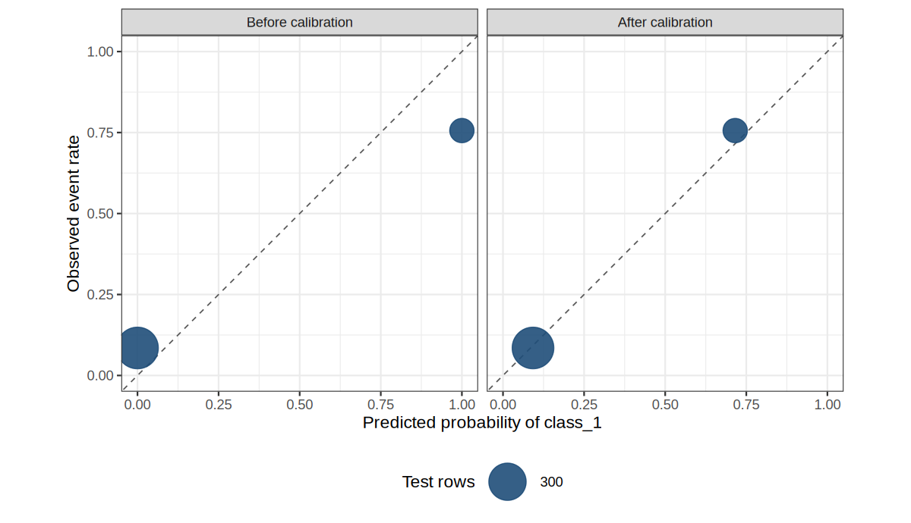

<!-- Preview image is preview.png, saved from the calibration plot in this post. -->

{.preview-image}

# A passing Brier score can still be a bad probability

I learned these calibration methods at the advanced tidymodels workshop [Max Kuhn](https://max-kuhn.org/){target="_blank"} and [Emil Hvitfeldt](https://emilhvitfeldt.com/){target="_blank"} taught at posit::conf 2025. I came to tidymodels early from caret, and I still see pipelines that stop once [`brier_class()`](https://yardstick.tidymodels.org/reference/brier_class.html){target="_blank"} looks acceptable.

A classifier offers two outputs. The hard class is the label it assigns, for example `class_1` or `class_2`. The classification probability is a number from 0 to 1 for how likely the event is. The event is the positive class, the outcome being counted.

Calibrated means that probability matches the frequency. When the model says 0.7, about 70% of those rows are events.

That is too early when the probabilities are the product. A tree can rank rows well, land under the 0.25 Brier score I treat as a poor classifier, and still predict 0 and 1 for groups whose event rates are nowhere near 0 and 1. The fix belongs in the same workflow as the recipe and the model.

Brier score is the mean squared error of those probabilities. Lower is better. Always predicting 0.5 scores 0.25. Always predicting the event rate, the share of rows that are events, is the tighter reference, because it knows the base rate and nothing about the predictors.

On this test set the event rate rounds to 0.25, and the base-rate Brier (that rate times one minus that rate) rounds to 0.188. The scoring chunk prints both numbers again from the test rows.

The rows are a simulated set from modeldata. The folded chunk loads the packages, simulates 2,000 rows, and splits them twice with `prop = 0.75`, stratified on `class`. The first split holds out the test set. The second holds the calibration set out of the remaining rows.

Model rows fit the tree. Calibration rows are what the post-processor uses to learn a correction from the tree's probabilities to observed event rates. Test rows are only for the final score.

Fitting the calibrator on the model rows teaches the wrong mapping. The tree has memorized those rows, so its probabilities there are overconfident, pushed toward 0 and 1. The calibrator pairs those scores with outcomes the tree already fit, and it learns a correction that is too small for new rows.

Test rows have to stay out of both fits. Once they train the calibrator, the test score is no longer an honest estimate of new data.

The printed table should show model, calibration, and test, and the row counts should sum to 2,000. The workflow in the next section is the part worth copying.

```{r}
#| label: setup
#| code-fold: true
#| code-summary: "Packages, simulated data, and the three-way split"

library(tidymodels)
library(probably)

tidymodels_prefer()
theme_set(theme_bw())

set.seed(924)
sim_data <- sim_classification(2000, intercept = -8)

set.seed(925)
data_split <- initial_split(sim_data, prop = 0.75, strata = class)
train_data <- training(data_split)
test_data <- testing(data_split)

set.seed(926)
cal_split <- initial_split(train_data, prop = 0.75, strata = class)
model_data <- training(cal_split)
calibration_data <- testing(cal_split)

tibble(
  set = c("model", "calibration", "test"),
  rows = c(nrow(model_data), nrow(calibration_data), nrow(test_data))
)
```

# The pattern I fit

`workflows` 1.3.0 takes a [tailor](https://tailor.tidymodels.org/){target="_blank"} as the third argument. [`adjust_probability_calibration()`](https://tailor.tidymodels.org/reference/adjust_probability_calibration.html){target="_blank"} is the classification calibrator.

I pass `smooth = FALSE` so the method is a logistic regression (`stats::glm()`), the Platt-style calibrator. The default, `smooth = TRUE`, fits a GAM through `mgcv`. This tree emits only a few distinct probabilities, and a spline is extra machinery I do not need.

[`modeldata::sim_classification()`](https://modeldata.tidymodels.org/reference/sim_classification.html){target="_blank"} ships with the package, so render time does not download anything. `intercept = -8` puts the event (`class_1`, the first factor level, so yardstick's default event) near a quarter of the rows. The three sets in that table are disjoint: model, calibration, and test.

`event_level = "first"` in the metrics later tells yardstick to score `.pred_class_1` against that first factor level.

A recipe is the preprocessing plan, run before the model. This one is `step_normalize()` on the numeric predictors. A model spec is the algorithm and its hyperparameters before any fit. The spec below is `decision_tree()` with `tree_depth = 15`, `min_n = 2`, and `cost_complexity = 1e-8`, engine `rpart`, mode classification.

A tailor is a post-processor. It adjusts the model's predictions, and it is trained on its own rows. This tailor is logistic calibration. A workflow is the recipe, the spec, and the tailor bundled into one object.

I want that bundle in production. `predict()` then runs the same steps in the same order: normalize, predict with the tree, then calibrate. One object is how I avoid train/serve skew, where serving drops a step or reimplements it differently.

The chunk prints the unfitted workflow. Expect the recipe, the tree spec, and a tailor that has not been trained yet.

```{r}
#| label: pattern

cal_tailor <-
  tailor() |>
  adjust_probability_calibration(method = "logistic", smooth = FALSE)

tree_spec <-
  decision_tree(
    tree_depth = 15,
    min_n = 2,
    cost_complexity = 1e-8
  ) |>
  set_engine("rpart") |>
  set_mode("classification")

tree_rec <-
  recipe(class ~ ., data = train_data) |>
  step_normalize(all_numeric_predictors())

tree_wflow <- workflow(tree_rec, tree_spec, cal_tailor)
tree_wflow
```

The three `NA` lines under the postprocessor are the calibrator before it is trained. `fit()` fills them from `data_calibration`.

The recipe and the model train on `data`. The calibrator trains on predictions from `data_calibration`. Those have to be different rows.

In-sample probabilities sit closer to the outcome than probabilities on new data. A calibrator fit on the training predictions looks finished when it is not.

This chunk fits that tree twice and prints nothing. `tree_raw_fit` is the recipe and the tree on `model_data` only. `tree_cal_fit` trains the tailor on `calibration_data`. The next section scores both on the test set, which neither fit has seen.

```{r}
#| label: fit-tree
#| code-fold: true
#| code-summary: "Fit the same tree with and without the calibrator"
#| results: hide

tree_raw_wflow <- workflow(tree_rec, tree_spec)

tree_raw_fit <- fit(tree_raw_wflow, data = model_data)

tree_cal_fit <- fit(
  tree_wflow,
  data = model_data,
  data_calibration = calibration_data
)
```

::: {.callout-tip}
## `fit()` will ask for calibration data

Omitting `data_calibration` is an error: "The workflow requires `data_calibration` to train but none was supplied." I want that error. During resampling, [`tune`](https://tune.tidymodels.org/){target="_blank"} makes the split for me with [`rsample::internal_calibration_split()`](https://rsample.tidymodels.org/reference/internal_calibration_split.html){target="_blank"}. With 5-fold cross-validation, about a fifth of each analysis set is held out to train the calibrator.
:::

# The score looked fine

`min_n = 2` and a deep tree are deliberate. `tree_depth = 15` lets splits continue for 15 levels, and `cost_complexity = 1e-8` is small enough that rpart keeps them. `min_n = 2` means a node with two rows can still be split, so the leaves are tiny and pure.

The leaves go pure, so `rpart` reports class probabilities of 0 and 1. A pure leaf is all one class, and rpart stores that class's share of the leaf, which is 0 or 1. That is the failure mode I want on the page. A tuned depth comes later.

This chunk scores both fits on the test set and hides the printout. It stores accuracy, ROC AUC, Brier score, and a ten-bin `calibration_gap` on `tree_scores`. The next chunk prints that table.

```{r}
#| label: score-helpers
#| code-fold: true
#| code-summary: "Metrics, including a bin-wise calibration gap"
#| results: hide

predict_test <- function(fit) {
  bind_cols(
    test_data["class"],
    predict(fit, test_data, type = "class"),
    predict(fit, test_data, type = "prob")
  )
}

calibration_gap <- function(df, n_bins = 10) {
  breaks <- seq(0, 1, length.out = n_bins + 1)
  df |>
    mutate(
      bin = cut(
        .pred_class_1,
        breaks = breaks,
        include.lowest = TRUE
      ),
      event = as.integer(class == "class_1")
    ) |>
    group_by(bin) |>
    summarise(
      n = n(),
      predicted = mean(.pred_class_1),
      observed = mean(event),
      .groups = "drop"
    ) |>
    summarise(gap = weighted.mean(abs(predicted - observed), n)) |>
    pull(gap)
}

score_fit <- function(fit, label) {
  df <- predict_test(fit)
  scored <- bind_rows(
    accuracy(df, truth = class, estimate = .pred_class),
    roc_auc(df, truth = class, .pred_class_1, event_level = "first"),
    brier_class(df, truth = class, .pred_class_1, event_level = "first")
  ) |>
    select(.metric, .estimate) |>
    pivot_wider(names_from = .metric, values_from = .estimate) |>
    mutate(calibration_gap = calibration_gap(df), model = label, .before = 1)
  list(scores = scored, predictions = df)
}

test_base_rate <- mean(test_data$class == "class_1")
test_base_brier <- test_base_rate * (1 - test_base_rate)
majority_accuracy <- mean(test_data$class == "class_2")

tree_before <- score_fit(tree_raw_fit, "Tree, before")
tree_after <- score_fit(tree_cal_fit, "Tree, after")

tree_scores <- bind_rows(tree_before$scores, tree_after$scores) |>
  mutate(across(where(is.numeric), \(x) round(x, 3)))
```

Brier score is a mean squared error on the probabilities. It punishes a bad ranking and a bad scale at the same time. Predicting 0.5 for every row scores 0.25. Predicting this test set's base rate (`r round(test_base_rate, 3)`) for every row scores `r round(test_base_brier, 3)`.

This chunk prints `tree_scores`, rounded to three decimals. I want accuracy and ROC AUC to match across the two rows, and I want Brier score and `calibration_gap` to drop after calibration.

```{r}
#| label: tree-scores
#| code-fold: true
#| code-summary: "Test-set metrics for the tree"

tree_scores
```

Accuracy is the share of test rows whose hard class matches the truth. It is `r tree_scores$accuracy[1]` either way, against a majority-class baseline of `r round(majority_accuracy, 3)`. That baseline is the accuracy from ignoring the model and always predicting the majority class, `class_2`.

ROC AUC measures ranking only. It asks whether events get higher probabilities than non-events, and it ignores whether those probabilities are on the right scale. ROC AUC stays at `r tree_scores$roc_auc[1]`.

The hard class matches on `r sum(tree_before$predictions$.pred_class == tree_after$predictions$.pred_class)` of `r nrow(test_data)` test rows. Both calibrated probabilities sit on the same side of 0.5 as the raw 0 and 1.

Brier score moves from `r tree_scores$brier_class[1]` to `r tree_scores$brier_class[2]`. `calibration_gap` is the average absolute difference between predicted probability and observed event rate, inside ten equal-width bins.

Before calibration that gap equals the Brier score. Predictions stuck at 0 and 1 make a squared error the same as an absolute error, so the whole `r tree_scores$brier_class[1]` is miscalibration. After calibration the gap falls to `r tree_scores$calibration_gap[2]`. What remains in the Brier score is the part a probability adjustment cannot reorder away.

This chunk lists every distinct predicted probability on the test set, with the row count and the observed event rate. Before calibration I expect only 0 and 1. The `observed` column is the rate those predictions should have matched.

```{r}
#| label: reliability-table
#| code-fold: true
#| code-summary: "The only probabilities this tree produces"

probability_table <- function(df, label) {
  df |>
    mutate(event = class == "class_1") |>
    group_by(stage = label, predicted = .pred_class_1) |>
    summarise(rows = n(), observed = mean(event), .groups = "drop") |>
    mutate(across(c(predicted, observed), \(x) round(x, 3)))
}

probability_summary <- bind_rows(
  probability_table(tree_before$predictions, "Before calibration"),
  probability_table(tree_after$predictions, "After calibration")
)

probability_summary
```

Every test row is a 0 or a 1 before calibration. Rows scored 0 are events `r probability_summary$observed[probability_summary$stage == "Before calibration" & probability_summary$predicted == 0]` of the time. Rows scored 1 are events `r probability_summary$observed[probability_summary$stage == "Before calibration" & probability_summary$predicted == 1]` of the time. After calibration those two piles move to `r probability_summary$predicted[probability_summary$stage == "After calibration"][1]` and `r probability_summary$predicted[probability_summary$stage == "After calibration"][2]`, next to those same observed rates. Same rows, same order, usable numbers.

This chunk plots those piles. Each point is one distinct predicted probability, sized by how many test rows share it. The x-axis is the predicted probability of `class_1`. The y-axis is the observed event rate for that point. The gap above used ten equal-width bins. This tree only emits two probabilities, so the honest picture is two points, which is what the plot should show.

The dashed diagonal is perfect calibration: predicted probability equals the observed rate. A point below the line means the model is overpredicting events (the score is higher than the rate in that group). A point above the line means it is underpredicting. Before calibration the points sit at the edges, off the diagonal. After calibration they should sit close to it.

```{r}
#| label: calibration-plot
#| code-fold: true
#| code-summary: "Calibration plot"
#| fig-width: 8
#| fig-height: 4.6
#| fig-alt: "Two panels. Before calibration, predicted probabilities sit at 0 and 1 while observed event rates are near 0.08 and 0.76. After calibration, those predictions sit near the diagonal."
#| fig-cap: "Each point is one distinct predicted probability on the test set. Point size is the number of rows. The dashed line is perfect calibration."

calibration_points <- bind_rows(
  tree_before$predictions |> mutate(stage = "Before calibration"),
  tree_after$predictions |> mutate(stage = "After calibration")
) |>
  mutate(
    stage = factor(stage, levels = c("Before calibration", "After calibration")),
    event = as.integer(class == "class_1")
  ) |>
  group_by(stage, predicted = .pred_class_1) |>
  summarise(rows = n(), observed = mean(event), .groups = "drop")

calibration_plot <-
  ggplot(calibration_points, aes(predicted, observed)) +
  geom_abline(slope = 1, intercept = 0, linetype = 2, linewidth = 0.4, color = "grey35") +
  geom_point(aes(size = rows), color = "#1f4e79", alpha = 0.9) +
  facet_wrap(~ stage) +
  coord_equal(xlim = c(0, 1), ylim = c(0, 1)) +
  scale_x_continuous(breaks = seq(0, 1, by = 0.25)) +
  scale_y_continuous(breaks = seq(0, 1, by = 0.25)) +
  scale_size_area(max_size = 12, breaks = c(100, 300)) +
  labs(
    x = "Predicted probability of class_1",
    y = "Observed event rate",
    size = "Test rows"
  ) +
  theme(legend.position = "bottom")

ggsave(
  "preview.png",
  calibration_plot,
  width = 8,
  height = 4.6,
  dpi = 150,
  bg = "white"
)

calibration_plot
```

This chunk is the histogram of those same predicted probabilities, drawn as bar height for the row counts. Piles at 0 and at 1 are the overconfidence signal: the model is claiming certainty for large groups of rows. After calibration those bars should move in from the edges, toward the observed event rates. The row counts in the two piles should stay the same, because calibration does not reshuffle which rows are high and which are low.

```{r}
#| label: probability-histogram
#| code-fold: true
#| code-summary: "Histogram of predicted probabilities"
#| fig-width: 8
#| fig-height: 3.6
#| fig-alt: "Histograms of predicted class_1 probabilities. Before calibration every value is 0 or 1. After calibration those spikes move inward."
#| fig-cap: "Calibration moves the two spikes toward the observed event rates. It does not invent a new ranking."

ggplot(calibration_points, aes(predicted, rows)) +
  geom_col(fill = "#1f4e79", width = 0.04) +
  facet_wrap(~ stage) +
  scale_x_continuous(limits = c(0, 1), breaks = seq(0, 1, by = 0.25)) +
  labs(x = "Predicted probability of class_1", y = "Test rows")
```

[`probably::cal_plot_windowed()`](https://probably.tidymodels.org/reference/cal_plot_windowed.html){target="_blank"} is what I use when a model produces a spread of probabilities (it is the plot from the workshop). Here it would draw a smooth curve through two spikes and invent probabilities the tree never made. The binned plot matches the model.

# When I leave the calibrator out

Same split, same logistic calibrator, a logistic regression instead of the tree.

This chunk fits that logistic regression with and without the calibrator, and it prints nothing. A logistic regression already fits probabilities with a logistic curve, so I expect little systematic bend left for the tailor to remove. The next table is the check.

```{r}
#| label: logistic
#| code-fold: true
#| code-summary: "Logistic regression, before and after the same calibrator"
#| results: hide

logit_spec <- logistic_reg()
logit_raw_fit <- fit(workflow(tree_rec, logit_spec), data = model_data)
logit_cal_fit <- fit(
  workflow(tree_rec, logit_spec, cal_tailor),
  data = model_data,
  data_calibration = calibration_data
)

logit_before <- score_fit(logit_raw_fit, "Logistic regression, before")
logit_after <- score_fit(logit_cal_fit, "Logistic regression, after")

logit_scores <- bind_rows(logit_before$scores, logit_after$scores) |>
  mutate(across(where(is.numeric), \(x) round(x, 3)))
```

This chunk prints the same four metrics for the logistic regression. I am looking for a Brier score and a calibration gap that do not improve, and for an ROC AUC that stays put.

```{r}
#| label: logit-scores
#| code-fold: true
#| code-summary: "Test-set metrics for the logistic regression"

logit_scores
```

I recommend keeping the calibrator when the probability histogram is piled on the edges, or when `calibration_gap` is large next to the Brier score. I take it out when the model already speaks in probabilities and the gap is small. This logistic regression is that second case. Brier goes from `r logit_scores$brier_class[1]` to `r logit_scores$brier_class[2]`, a small step in the wrong direction, and the calibration gap does not improve. A second logistic fit on a few hundred calibration rows has no systematic bend to remove.

I do not calibrate by default. This model is already calibrated. The extra fit adds variance, and the calibration split is data the model never sees, for little or no gain.

A few rules I use on top of that plot:

- ROC AUC is unchanged for both models here. Logistic calibration is a monotonic transform of the predicted probability only, so the ranking of rows is unchanged. If I only need a ranking, I skip it.
- Accuracy stayed flat for the tree. For the logistic regression it moved from `r logit_scores$accuracy[1]` to `r logit_scores$accuracy[2]`, because a few probabilities crossed 0.5. A hard label is a blunt summary of a probability.
- Thresholds do not repair calibration. [`adjust_probability_threshold()`](https://tailor.tidymodels.org/reference/adjust_probability_threshold.html){target="_blank"} changes the hard class, and it leaves Brier score and ROC AUC alone. Put it after calibration.
- Isotonic regression (`method = "isotonic"`) is the other base-R option, and it is a step function. Beta calibration is available too, through the [betacal](https://cran.r-project.org/package=betacal){target="_blank"} package. I start with logistic, then look at the plot.
- A calibration set with zero or one row makes tailor switch the method to `"none"`. I keep a few hundred events in that split when I can.

::: {.callout-tip}
## Calibrate, then threshold

tailor stops if a threshold or an equivocal zone is declared before the probability update. Those steps rewrite the hard class. On this tree the calibrated probabilities sit near 0.09 and 0.72, so any cutoff between them assigns the same class the raw 0 and 1 did.

The chunk builds the tailor in the wrong order and catches the error. The message should say that adjustments which change the hard class have to come after the probability update.

```{r}
#| label: order-check
#| code-fold: true
#| code-summary: "The error if the threshold comes first"

threshold_first <- tryCatch(
  tailor() |>
    adjust_probability_threshold(threshold = 0.2) |>
    adjust_probability_calibration(method = "logistic", smooth = FALSE),
  error = function(e) conditionMessage(e)
)

threshold_first
```
:::

# One workflow, with the tune included

The depth-15 tree was a demonstration of pure leaves. I would not ship it only because the calibrator patched the scale. With the tailor already attached, `tune_grid()` scores candidates after post-processing, which is the comparison I want. Three depths, five folds, on the training data. tune holds out the calibration rows inside each analysis set, so this call does not take `data_calibration`.

The gain is a depth chosen for the probabilities I will actually ship. Each resample fits its own calibrator on rows held out from that resample's model fit, so the tree's training rows do not leak into the calibration.

This chunk tunes `tree_depth` over 4, 8, and 15, with `min_n` still 2 and `cost_complexity` still `1e-8`. The table is mean Brier score and ROC AUC across folds, plus the standard error. I take the lowest Brier score.

```{r}
#| label: tune-depth
#| code-fold: true
#| code-summary: "Tune tree depth with the calibrator attached"

set.seed(927)
depth_folds <- vfold_cv(train_data, v = 5, strata = class)

depth_spec <-
  decision_tree(
    tree_depth = tune(),
    min_n = 2,
    cost_complexity = 1e-8
  ) |>
  set_engine("rpart") |>
  set_mode("classification")

depth_wflow <- workflow(tree_rec, depth_spec, cal_tailor)

set.seed(12)
depth_res <- tune_grid(
  depth_wflow,
  resamples = depth_folds,
  grid = tibble(tree_depth = c(4L, 8L, 15L)),
  metrics = metric_set(brier_class, roc_auc)
)

depth_metrics <-
  collect_metrics(depth_res) |>
  select(tree_depth, .metric, mean, std_err) |>
  arrange(.metric, tree_depth) |>
  mutate(across(c(mean, std_err), \(x) round(x, 3)))

depth_metrics
```

This chunk locks in the best depth with `select_best()` and `finalize_workflow()`, then fits once on `model_data` and `calibration_data`. I want `tree_depth` filled in on the spec. I want `extract_postprocessor()` to show a trained calibrator where the earlier printout had `NA`.

```{r}
#| label: finalize
#| code-fold: true
#| code-summary: "Finalize the best depth and fit one workflow"

best_depth <- select_best(depth_res, metric = "brier_class")
best_depth

final_wflow <- finalize_workflow(depth_wflow, best_depth)
final_wflow

final_fit <- fit(
  final_wflow,
  data = model_data,
  data_calibration = calibration_data
)

extract_postprocessor(final_fit)
```

Depth `r best_depth$tree_depth` wins on resampled Brier score. Calibration did not promote the overgrown tree. I still keep the calibrator in `final_wflow`: the object that gets predicted from runs the recipe, the tree, and the logistic adjustment, in that order. `predict(final_fit, new_data, type = "prob")` is the whole path.

[orbital](https://orbital.tidymodels.org/articles/supported-models.html){target="_blank"} translates a fitted workflow into SQL, so predictions can run inside the database without R. Version 0.7.0 covers this `step_normalize()` recipe and this `decision_tree(engine = "rpart")` model, including class and probability predictions.

`adjust_probability_calibration()` is outside that list (orbital's tailor support is `adjust_probability_threshold()`, `adjust_equivocal_zone()`, `adjust_numeric_range()`, and `adjust_predictions_custom()`). The calibration step is what orbital cannot translate yet, so this calibrated workflow stays in R.

# Learn more

- [tailor](https://tailor.tidymodels.org/){target="_blank"}, by Simon Couch, Hannah Frick, Emil Hvitfeldt, and Max Kuhn. The [calibration reference](https://tailor.tidymodels.org/reference/adjust_probability_calibration.html){target="_blank"} documents logistic, multinomial, beta, and isotonic methods.
- [`add_tailor()`](https://workflows.tidymodels.org/reference/add_tailor.html){target="_blank"} and [`fit.workflow()`](https://workflows.tidymodels.org/reference/fit-workflow.html){target="_blank"} on `data` versus `data_calibration`. workflows 1.3.0 added the postprocessor stage.
- [tune 2.0.0](https://opensource.posit.co/blog/2025-11-05_tune-2/){target="_blank"} tunes tailor parameters and replaced foreach with future and mirai. tune 2.1.0 restored the submodel trick for the model and for the calibration model.
- [probably](https://probably.tidymodels.org/){target="_blank"} supplies the calibration estimators and the `cal_plot_*()` family. yardstick 1.4.0 gave `brier_class()` an `event_level` argument. It still does not ship a standalone calibration metric, which is why the bin gap above is computed in the post.
- [Calibration in Applied Machine Learning for Tabular Data](https://aml4td.org/chapters/cls-metrics.html#sec-cls-calibration){target="_blank"}, Max Kuhn's chapter on the same idea.
- [orbital's supported models, recipes, and tailor steps](https://orbital.tidymodels.org/articles/supported-models.html){target="_blank"}.

The pattern I want in production is the fitted `final_wflow`: preprocess, model, then calibrate, scored after the adjustment. If your probability histogram is already a smooth ramp along the diagonal, delete the tailor and keep the simpler object.

When an agent writes the model for me, I check:

- Calibration rows that were not used to fit the model, and a test set that was used for neither.
- A calibration plot, points against the diagonal. A metric on its own can still hide probabilities stuck at 0 and 1.
- Brier score next to the base-rate reference (0.188 on this test set) and next to the 0.25 from always predicting 0.5.
- Post-processing order: calibrate, then set a threshold. A cutoff rewrites the hard class and leaves the probabilities alone.
- One workflow object for `predict()`, so the recipe, the model, and the calibrator run in that order.

Happy Thursday, and happy coding!

```{r}
#| eval: false
sessionInfo()
```
